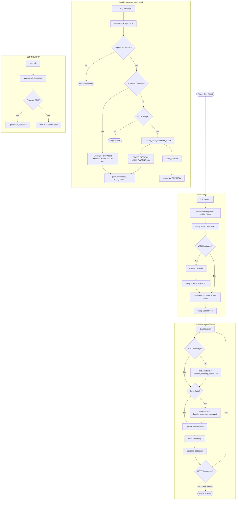

# nmaster.py Operational Flowchart (Refined)

This flowchart visualizes the logic of the Master firmware, corrected for syntax and subgraph structure.

## Key Components

- **`init_system`**: Sets up the environment, networking, and protocols.
- **`handle_incoming_command`**: The central routing point for all commands (Serial or MQTT).
- **`MASTER_DISPATCH`**: Handles local configuration and status commands.
- **`SLAVE_DISPATCH`**: Handles commands intended for slave nodes (e.g., scanning, firmware updates).
- **`recv_cb`**: Asynchronous handler for incoming ESP-NOW messages from slaves.
