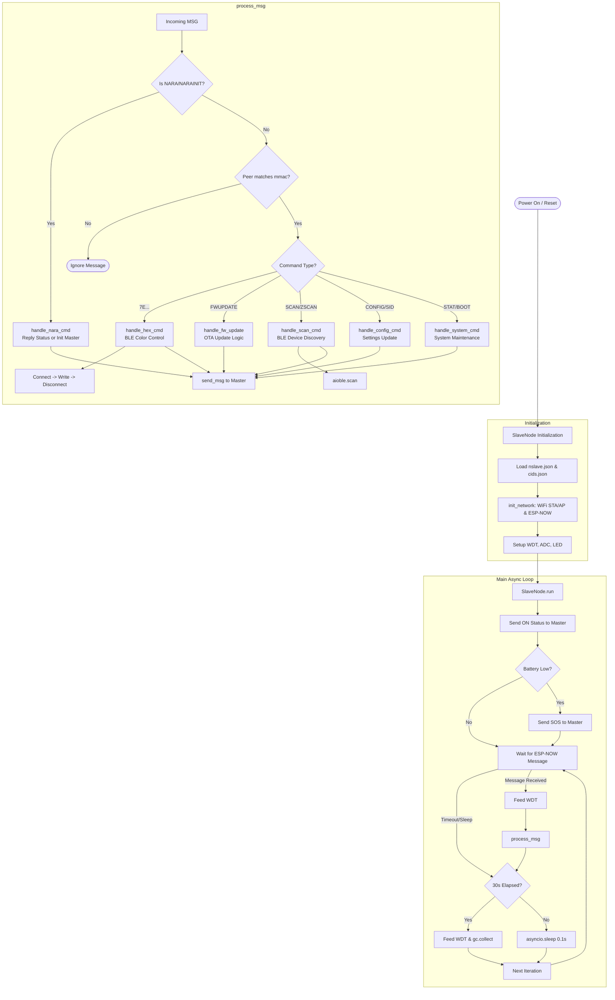

# nslave.py Operational Flowchart

This flowchart visualizes the logic of the Slave firmware used in the LED control system.

## Key Components

- **`SlaveNode`**: The central controller class managing state and communications.
- **`NLED`**: A helper class for managing BLE connections and writes to LED controllers.
- **`process_msg`**: Dispatches commands received via ESP-NOW to specialized handlers.
- **`handle_hex_cmd`**: The core function for forwarding color commands from the Master to controllers.
- **`handle_fw_update`**: Manages the piecewise reception and application of firmware updates.
